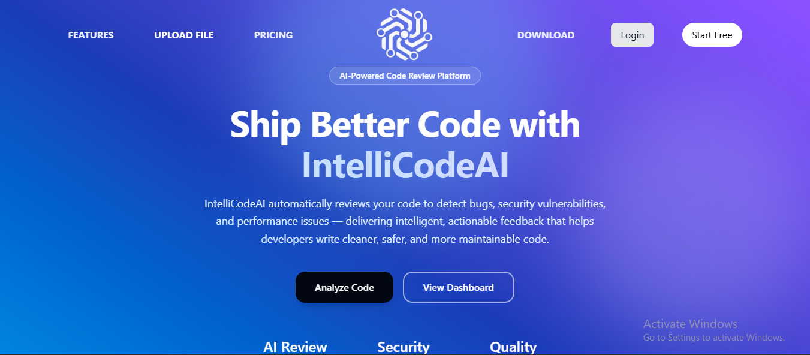
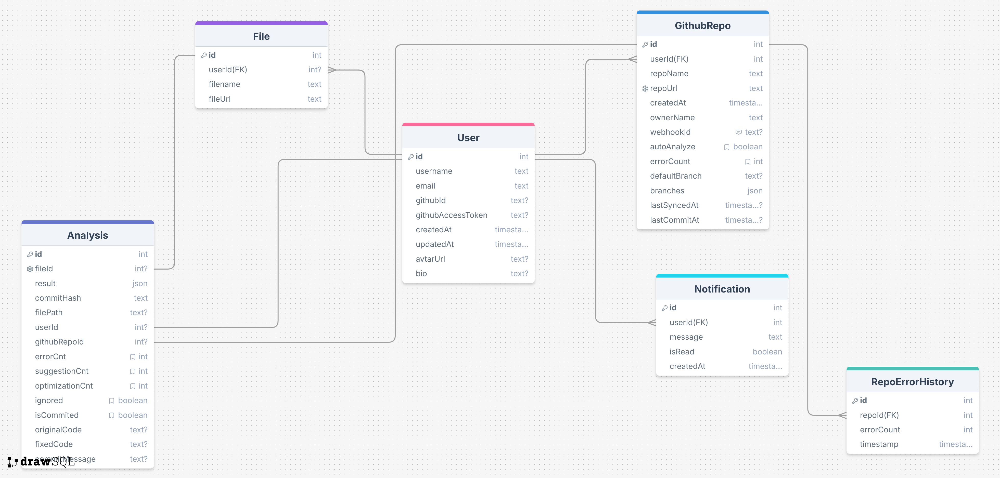
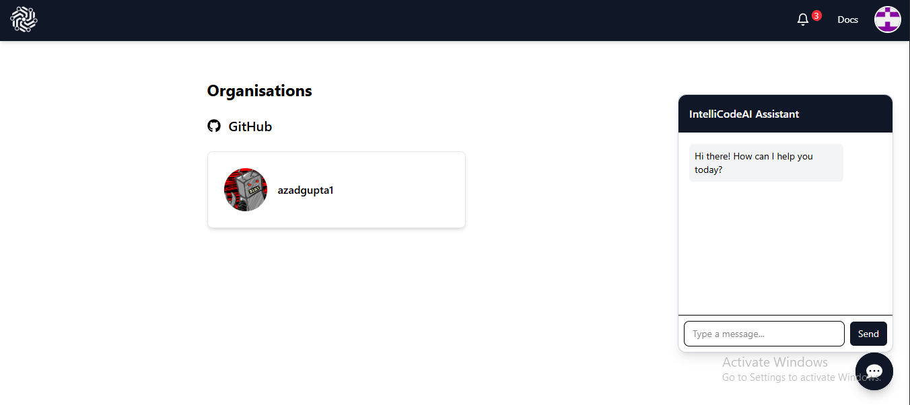
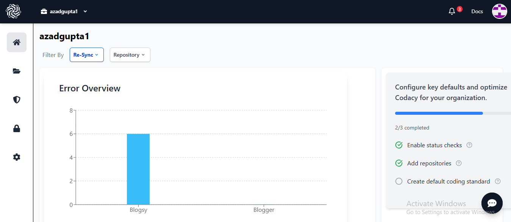
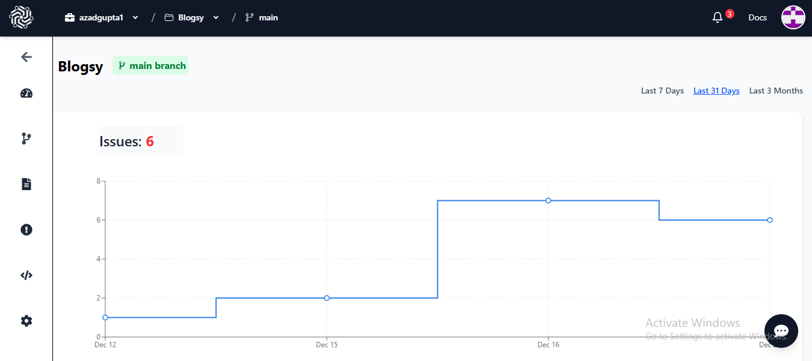
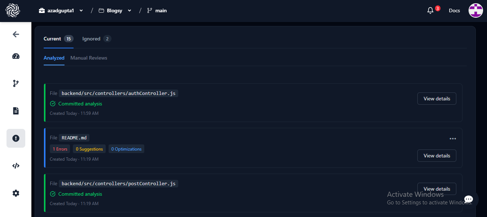
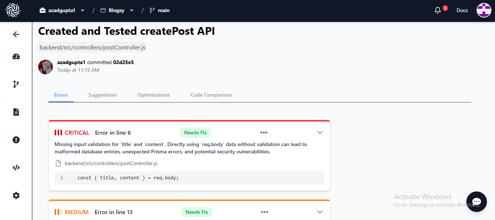

<p align="center">
  
</p>

<h1 align="center">IntelliCodeAI</h1>
<p align="center"><strong>AI-Powered Code Review Platform for Modern Development Teams</strong></p>

<p align="center">
  <em>Automated AI code reviews, GitHub-native workflows, and production-grade architecture.</em>
</p>

---

> **IntelliCodeAI** is a full-stack AI code review platform that integrates directly with GitHub to automatically analyze commits, detect issues, suggest fixes, and push improvements — **before code reaches production**.

Built to mirror real-world developer workflows, IntelliCodeAI combines **LLM-driven analysis**, **GitHub automation**, and a **production-grade backend** to deliver continuous code quality at scale.


---


## 🚀 Why IntelliCodeAI

Code reviews often become a bottleneck due to limited reviewer availability, inconsistent standards, and delayed feedback. As codebases grow, issues such as bugs, performance regressions, and poor design patterns are frequently detected too late in the development lifecycle.



**IntelliCodeAI provides continuous, automated code review directly within the GitHub workflow.**  
By analyzing every commit in real time, it helps teams catch issues early, enforce consistent quality standards, and reduce the operational overhead of manual reviews.

**Key benefits**
- Faster feedback cycles  
- Higher and more consistent code quality  
- Reduced manual review effort  

---

## Key Capabilities

- Automated code analysis triggered on every commit  
- Secure GitHub authentication using OAuth  
- Real-time analysis powered by GitHub webhooks  
- Side-by-side AI-generated fix suggestions  
- In-platform code editing and commit workflow  
- Repository-level health insights and error trends  

---

## Core Features

### AI-Powered Code Analysis
- Identifies bugs, logical errors, and performance issues  
- Detects anti-patterns and maintainability concerns  
- Powered by large language models (Google Gemini Flash)

---

### GitHub-Native Integration
- Seamless GitHub OAuth-based authentication  
- Analyze individual files, commits, or entire repositories  
- Automatic analysis on new commits via webhooks

---

### AI Fix Suggestions
- Clear comparison between original and improved code  
- Apply recommended fixes with a single action  
- Commit changes directly back to GitHub

---

### In-Platform Code Editor
- Review and refine AI suggestions within the platform  
- Maintain full control before committing changes

---

### Analytics Dashboard
- Historical analysis records  
- Error frequency and trend tracking  
- High-level repository health overview

---

### Real-Time Notifications
- Commit activity updates  
- Newly detected issues  
- Applied fixes and analysis results

---

## 🧠 System Architecture


**Flow Overview**
1. GitHub event triggers webhook  
2. Backend queues AI analysis  
3. LLM evaluates code  
4. Results stored & visualized  
5. Optional fix committed back to GitHub  

---

## 🗄️ Database Design



- Normalized relational schema
- Prisma ORM
- Optimized for scalability and traceability

---

## 📸 Product Screenshots

| Dashboard | Overview |
|----------|----------|
|  |  |

| Repo Overview | Analysis |
|--------------|----------|
|  |  |

| Metrics | AI Suggestion |
|---------|---------------|
|  |  |


---

## 🛠️ Tech Stack

### Frontend
- React (Vite)
- Tailwind CSS
- Framer Motion
- Monaco Editor
- TanStack Query

### Backend
- Node.js + Express
- PostgreSQL
- Prisma ORM
- Google Gemini API
- GitHub REST & Webhook APIs

### Infrastructure & Auth
- JWT Authentication
- GitHub OAuth
- Ngrok (local webhook testing)

---

## 🧪 Testing Strategy

- Manual API testing using Postman
- Webhook validation via Ngrok
- Edge-case testing:
  - Invalid OAuth states
  - Large commits
  - Concurrent analysis limits

> Designed around real production workflows, not just happy paths.

---

## ⚙️ Getting Started

### Prerequisites
- Node.js >= 18
- PostgreSQL
- GitHub OAuth App
- Google Gemini API Key

---

### Backend Setup

```bash
cd backend
cp .env.example .env
npm install
npx prisma generate
npx prisma migrate dev
npm run dev
```


### Frontend Setup
```bash
cd frontend
npm install
npm run dev
```

### Environment Variables (Backend)
```bash
PORT=3000
DATABASE_URL=

JWT_SECRET=
JWT_EXPIRATION=12h

GITHUB_CLIENT_ID=
GITHUB_CLIENT_SECRET=
GITHUB_REDIRECT_URI=

GEMINI_API_KEY=
GEMINI_API_KEY_CHATBOT=

FRONTEND_URL=http://localhost:5173
WEBHOOK_URL=<ngrok_url>
```

### Environment Variables (Frontend)
```bash
VITE_API_BASE_URL=http://localhost:3000
VITE_FRONTEND_URL=http://localhost:5173
```


## 🌱 Roadmap
- Pull Request inline comments
- Team-level analytics
- CI/CD integration
- Multi-language support


## Author
### Azad Gupta
Full-Stack Developer | AI-Focused Systems

- Built with a strong emphasis on real-world engineering practices, scalability, and developer productivity.